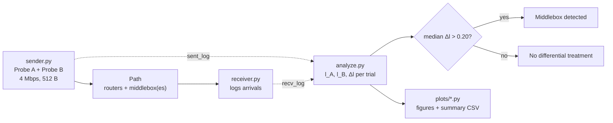
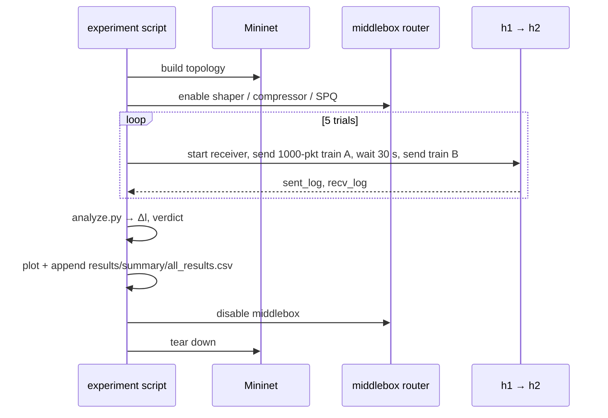
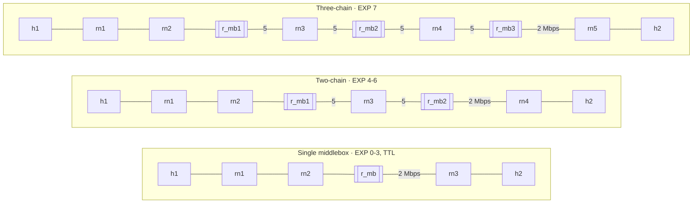
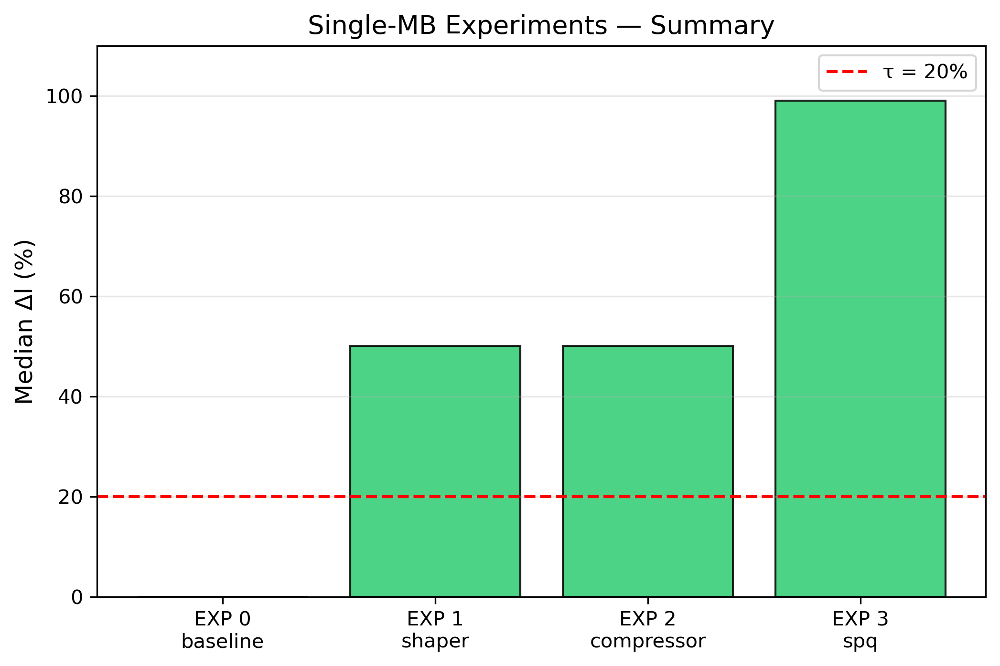
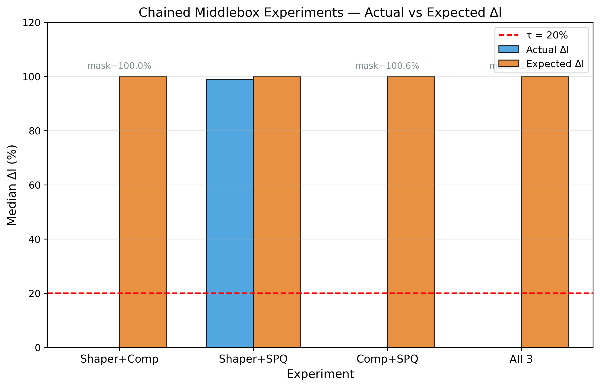
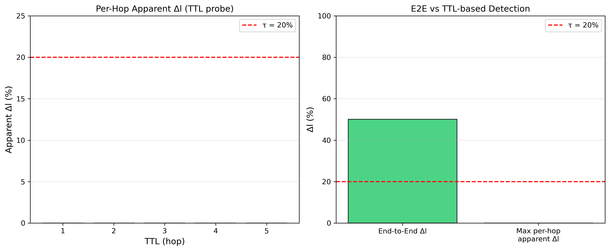

# Middlebox Detection via Differential Loss


A Mininet testbed that detects **hidden middleboxes** (traffic shapers, compressors, priority queues) on a network path from the endpoints alone, by comparing packet-loss rates of two carefully crafted UDP probe trains.

It reproduces the end-to-end detection technique of *Pournaghshband & Reiher (IEEE NOMS 2024)* and extends it in two directions the paper leaves open:

- **Chained middleboxes**: what happens to the detection signal when two or three middleboxes sit on the same path.
- **TTL-based localization**: whether the signal can be used to find *which hop* the middlebox is on.

**Key findings**

- Every single middlebox is detected reliably (median Δl of 0.50 to 0.99).
- Chaining middleboxes can **mask** each other: Shaper + Compressor drives Δl to 0, even though each is detected alone.
- TTL-limited probing **cannot localize** the middlebox. ICMP Time Exceeded replies are rate-limited (about 6 of 200 probes answered) and are generated before the middlebox's egress queue, so every hop looks identical.

---

## How it works

The sender emits two 1000-packet probe trains, **A** and **B**, 30 s apart. They are identical except for the one property a given middlebox discriminates on. If something on the path treats them differently, their loss rates diverge:

$$\Delta l = l_A - l_B \qquad \text{detected if median}(\Delta l) > \tau = 0.20$$

| Middlebox | Discriminating property | Probe A | Probe B |
|---|---|---|---|
| Traffic shaper | UDP source port | port 9000 (shaped) | port 9001 |
| Compressor | Payload entropy | random (incompressible) | zeros (compressible) |
| Strict priority queue | DSCP marking | 1 low-priority pkt per 4 EF pkts | 1 EF pkt per 4 low-priority pkts |



Each experiment script runs the full pipeline end to end:



---

## Testbed

All links are 10 Mbps except the bottleneck (2 Mbps) after the last middlebox. The sender runs at 4 Mbps, so the bottleneck always overflows and differential treatment shows up as loss.



### Middlebox implementations

| Middlebox | Implementation |
|---|---|
| **Traffic shaper** | `tc` HTB class limiting source port 9000 to 2 Mbps with a 10-packet queue |
| **Compressor** | `iptables` → `NFQUEUE` daemon measures payload compressibility with `zlib`, marks incompressible packets DSCP EF, and `tc` HTB shapes EF traffic |
| **Strict priority queue** | `tc` PRIO qdisc, DSCP EF → band 0, served before all other traffic |

### Parameters

| Parameter | Value |
|---|---|
| Packets per train (ρ) | 1000 |
| Wait between trains (Λ) | 30 s |
| Packet size | 512 B |
| Sender rate | 4 Mbps |
| Bottleneck / shaper rate (σ) | 2 Mbps |
| Trials per experiment | 5 |
| Detection threshold (τ) | 0.20 |

---

## Results

| Exp | Middleboxes on path | Median Δl | Detected |
|---|---|---:|:---:|
| 0 | none (baseline) | 0.000 | ✗ |
| 1 | Shaper | 0.501 | ✓ |
| 2 | Compressor | 0.501 | ✓ |
| 3 | SPQ | 0.990 | ✓ |
| 4 | Shaper → Compressor | 0.000 | ✗ masked |
| 5 | Shaper → SPQ | 0.990 | ✓ |
| 6 | Compressor → SPQ | -0.006 | ✗ masked |
| 7 | Shaper → Compressor → SPQ | -0.153 | ✗ masked / inverted |

Full per-trial numbers: [`results/summary/all_results.csv`](middlebox_detection/results/summary/all_results.csv).

<p align="center">
  
  
</p>

**Masking.** Shaper and compressor are each detected on their own (Δl = 0.501), but chained in EXP 4 both probe trains lose the same fraction (l_A = l_B = 0.501), so Δl = 0 and a path with two middleboxes looks clean. EXP 6 behaves the same way. In EXP 7, Δl goes negative, so the detector sees the *opposite* of the real treatment. Only an SPQ at the end of the chain (EXP 5) keeps its signal.

**Localization fails.** Sweeping TTL from 1 to the destination gives an apparent Δl of about -0.005 at every hop, including the middlebox hop, for both shaper and compressor. The end-to-end Δl on the same path is 0.501.

<p align="center">
  
  
</p>

---

## Getting started

Requires Linux and root, since Mininet, `tc` and `iptables` need it. Tested on Ubuntu 22.04.

```bash
sudo apt install -y mininet python3-pip python3-dev libnetfilter-queue-dev iproute2
git clone https://github.com/Shaheen2504/Middle_Box_Detection.git
cd Middle_Box_Detection/middlebox_detection
sudo pip3 install -r requirements.txt
```

Run one experiment:

```bash
sudo mn -c                                 # clear stale Mininet state
sudo python3 experiments/exp1_shaper.py
```

Or run all of them in sequence:

```bash
sudo ./run_exp_in_order.sh
```

Each run writes `results/raw/<exp>/` (logs, `tc`/`iptables` snapshots, analysis JSON/CSV), appends to `results/summary/all_results.csv`, and regenerates the figures in `plots/figures/`.

---

## Project structure

```text
middlebox_detection/
├── topology/        Mininet topologies: single, two-chain, three-chain
├── middleboxes/     enable/disable functions for shaper, compressor, SPQ
│   └── _compressor_daemon.py   NFQUEUE packet classifier
├── probing/         sender.py, receiver.py, ttl_prober.py
├── analysis/        analyze.py: loss rates, Δl, detection verdict
├── experiments/     one runnable script per experiment
├── plots/           plotting scripts and generated figures
├── results/         per-experiment raw output and summary CSV
└── run_exp_in_order.sh
docs/report.pdf      full project report
```

---

## Limitations and future work

- Mininet only. Validating on physical or cloud paths with real cross-traffic is the obvious next step.
- Five trials per experiment with a fixed τ. More trials would allow confidence intervals, and τ could adapt to baseline noise.
- The middleboxes are synthetic. Real shapers and compressors may classify on other features.
- Localization needs a different mechanism than TTL expiry, for example cooperating vantage points.

## References

- M. Pournaghshband and P. Reiher, "End-to-End Detection of Middlebox Interference," *IEEE NOMS*, 2024.
- Chang, Rahimi and Pournaghshband, strict-priority-queue detection, *IJANS*, 2017.
- Nguyen and Roughan, loss-based inference and the τ = 20% threshold, *IEEE/ACM ToN*, 2013.
- Detal et al., "Revealing Middlebox Interference with Tracebox," *IMC*, 2013.
- Lantz, Heller and McKeown, "A Network in a Laptop" (Mininet), *HotNets*, 2010.

## License

[MIT](LICENSE)
